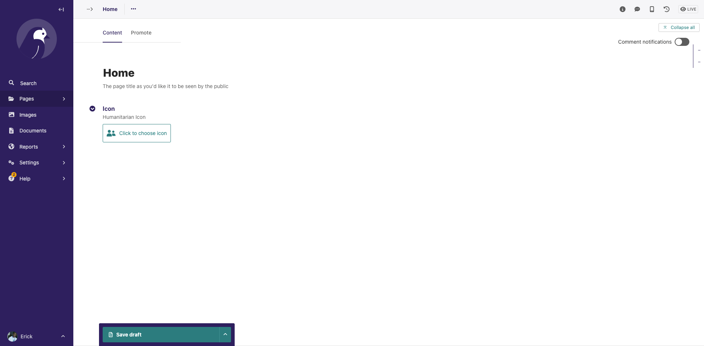
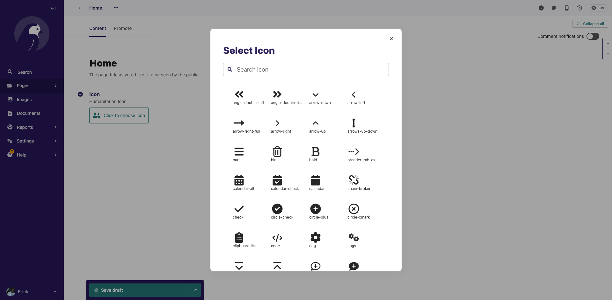

# Wagtail Humanitarian Icons

This Wagtail package brings [Ocha Humanitarian Icons](https://brand.unocha.org/d/xEPytAUjC3sH/icons) to Wagtail Admin, 
with a possibility to use the icons also on your frontend.

`NOTE`: The recent versions of Wagtail supports uploading SVGs directly to the images section of
the CMS interface. If you just need to upload SVG images and use them on you frontend, consider using that.
This package aims to provide a way to select and use predefined humanitarian icons from OCHA.

# Installation

```pip install wagtail-humanitarian-icons```

Add `wagtailhumanitarianicons` to your installed apps

```
 INSTALLED_APPS = [
        ...
        "wagtailhumanitarianicons",
        ...
        ]
```

# Using the icon chooser
To use the icon chooser, and an icon field to your wagtail page, and use the `IconChooserWidget`, widget for example:

```python
from django.db import models
from wagtail.admin.panels import FieldPanel
from wagtail.models import Page

from wagtailhumanitarianicons.widgets import IconChooserWidget

class MyPage(Page):
    icon = models.CharField(max_length=100, null=True, blank=True, help_text="Humanitarian Icon")

    content_panels = Page.content_panels + [
        FieldPanel("icon",widget=IconChooserWidget)
    ]
```

The `icon` field will be shown, with a button for selecting and showing the selected icon, as below:



Clicking on the button will show the icon chooser, with all the icons, including the Wagtail admin icons.
Scrolling down will show the Ocha humanitarian icons




The Icons can be used out of the box in templates rendered on the Wagtail admin, without any configuration.
To use them on your custom frontend templates, one way to do it is to use the following approach:

- Add all icons to your template's context, and have them as a svg sprite. Wagtail provides a way to get all the admin icons as a svg sprite, using a view found 
  at `wagtail.admin.views.home.icons`
- Add the svg sprite to your template
- use the `icon` template tag from `wagtailadmin_tags' to render your svg, which will the link with the icon from the svg sprite
- or directly render the svg to the template

We provide custom abstract page `CustomIconPage`, that helps you to achieve the above. 
This just overrides the `get_context` method of the Wagtail Page class, to add the svg sprite string.

```python
from django.db import models
from wagtail.admin.panels import FieldPanel
from wagtail.models import Page

from wagtailhumanitarianicons.models import CustomIconPage
from wagtailhumanitarianicons.widgets import IconChooserWidget

class MyPage(CustomIconPage, Page):
    icon = models.CharField(max_length=100, null=True, blank=True, help_text="Humanitarian Icon")

    content_panels = Page.content_panels + [
        FieldPanel("icon", widget=IconChooserWidget)
    ]
```

Your template will now have a svg sprite `context` object, with the key `icons_svg_sprite`

You can add the svg sprite anywhere in the template, and use the `icon` tag

```html


....



    
        {{ icons_svg_sprite|safe }}
    

    <div>
      
    </div>




.....
```

You can also directly render your icon without using the `icon` template tag.

Just replace `` with

```html
    
    {{ icons_svg_sprite|safe }}

    <svg class="icon">
        <use href="#icon-{{ page.icon }}"></use>
    </svg>

```

Have a look on the `sandbox/home/models.py` for a complete example, and `sandbox/home/templates` for an example on rendering on the frontend.

The code used to prepare the OCHA icons can be found at `wagtailhumanitarianicons/utils.py`